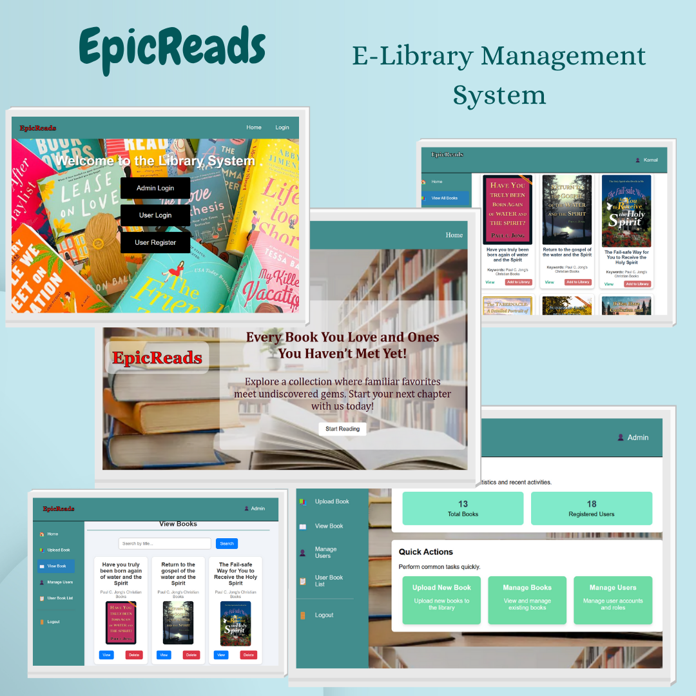

# 📚 EpicReads

  

EpicReads is a group project built with **HTML**, **CSS**, **JavaScript**, and **PHP**. It provides users with an interactive and responsive platform to **browse**, **manage**, and **explore** books, offering a dynamic and user-friendly reading experience.

---

## ✨ Features

- 📖 Browse a wide collection of books
- 🔍 Search and filter by title, author, or genre
- 📝 User-friendly interface for managing books
- 📱 Fully responsive design for mobile and desktop
- 🔐 User authentication (Login/Register)
- 🗃️ Backend integration with PHP & MySQL
- 🧩 Add, edit, or delete books (Admin feature)

---

## 🚀 Technologies Used

- **Frontend**: HTML5, CSS3, JavaScript (Vanilla)
- **Backend**: PHP
- **Database**: MySQL
- **Design**: Responsive layout using Flexbox and Grid

---

